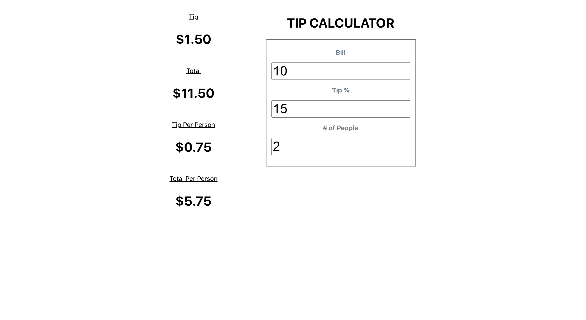

# Tip Calculator

## Description
A simple tip calculator using React and CSS. This project is based off the one Google provides when you search up tip calculator.

#### WORK IN PROGRESS
* Plans to add more styling.
* Plans to make it responsive.

## How to Use
1. Goto the Github Pages I currently have the tip calculator on [here](https://matthewwei35.github.io/tip-calculator/).
2. Enter in your specific information in the fields on the right column.
3. View your results on the left column.
